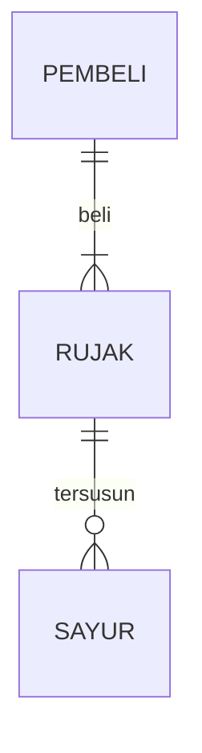

## 1.1 Latar Belakang

Latar belakang saya membuat game ular ialah karna waktu saya kecil, saya sangat suka dengan game yang namanya snake xenzia, dan seiring berjalannya waktu, saya ingin mempelajari bagaimana proses pembuatan game snake tersebut

## 1.2. Deksripsi Teknologi Informasi
Snake adalah nama umum untuk konsep permainan video dimana pemain mengendalikan sebuah garis yang tumbuh memanjang, dengan garis itu sendiri menjadi rintangan utama. Konsep tersebut bermula pada permainan arkade 1976 Blockade, dan kemudian membuat Snake menjadi memiliki ratusan versi (beberapa diantaranya memakai kata snake (ular) atau worm (ulat) pada judulnya) untuk beberapa wadah

## 1.3. Branding

game yang bernama Snake Game,

## 2. User Story

Sebagai | Saya Ingin | Agar | Priority
---|---|---|---
User | Ularnya bisa bergerak | bisa makan supaya bisa panjang | ⭐⭐⭐⭐⭐

## 3. Struktur Data

Cara membuat aneka macam bentuk grafik menggunakan mermaid.js bisa lihat di [https://mermaid.js.org/syntax/entityRelationshipDiagram.html](https://mermaid.js.org/syntax/entityRelationshipDiagram.html) 

## 4. Arsitektur Sistem

Masih pake mermaid.js juga bisa lihat flowchart di [https://mermaid.js.org/syntax/flowchart.html](https://mermaid.js.org/syntax/flowchart.html)

## 5. Teknologi, Library, dan Framework

Saya membuat game ini dengan device Lenovo dengan processor intel core I5 Gen 10 , SSD 512GB dengan grapics nvidia. Saya membuat game ini menggunakan bahasa Java dengan Framework Eclipse ID.
Library yang saya gunakan untuk membuat game ini ialah :
1. java.awt
2. java.awt.event
3. javax.swing
4. java.util.random

## 6. Desain User Experience dan User Interface

 

## 7. Demonstrasi Video

Link youtube nya

## 8. Bagaimana mesin komputasi dan sistem operasi berperan dalam produk teknologi informasimu ?

Link youtube nya di detik jawaban ini

## 9. Bagaimana algoritma, struktur data, dan bahasa pemrograman berperan dalam produk teknologi informasimu ?

Link youtube nya di detik jawaban ini

## 10. Bagaimana metode pengembangan perangkat lunak / Software Development Life Cycle berperan dalam produk teknologi informasimu ?

Link youtube nya di detik jawaban ini

## 11. Bagaimana database / sistem basis data berperan dalam produk teknologi informasimu ?

Link youtube nya di detik jawaban ini
