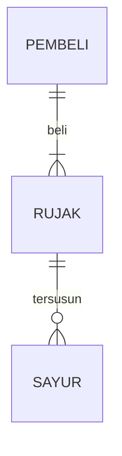

## 1.1 Latar Belakang
Game ini bernama GetCoin, game ini diciptakan karna saya ingin menuangkan isi pikiran saya tentang seorang pencari koin menggunakan gerobak. Di dalam game tersebut, si petani coin ini berkeliling hutan untuk mencari koin, demi keberlangsungan hidupnya yang memiliki keterbatasan dalam hal ekonomi.

## 1.2. Deksripsi Teknologi Informasi
GetCoin adalah sebuah game yang bertemakan sebuah cerita yang dimana ada tokohnya, bisa kita sebut Petani KOIN. Petani koin ini hidup disebuah tempat yang jauh dari keramaian, beliau tinggal di dekat hutan. 
Petani koin ini memiliki sebuah kesulitan di bidang ekonomi, dahulunya beliau hanya seorang pencari bahan makanan di hutan untuk keberlangsungan hidupnya. Dan pada suatu hari, ketika beliau sedang mencari bahan makanan, tiba-tiba beliau ini menemukan segumpalan koin yang sangat berkilau, lalu beliau menghampirinya, dan mengambilnya. Akhirnya beliau membawa koin ini ke rumah beliau.
Pada esok harinya, beliau pergi ke hutan untuk mencari koin tersebut, apakah masih ada atau tidak, petani koin ini berusaha mencari koin tersebut dengan mengelilingi seluruh tempat yang ada dihutan tersebut, disinilah saya ingin menggambarkan kisah petani koin itu kedalam sebuah game yang berjudul GetCoin
## 1.3. Branding
- Merek              : Get Coin
- Tagline            : Coin is My Life
- Kampanye           : Sebuah aplikasi game guna menjadi sebuah sarana hiburan
- Pengguna Sasaran   : Usia 9+
- Tema UI/UX         : Sederhana

## 2. User Story

Sebagai | Saya Ingin | Agar | Priority
---|---|---|---
User | Petani bisa bergerak | bisa menjelajahi hutan | ⭐⭐⭐⭐⭐
User | Petani bisa mengumpulkan koin | bisa menjadi kaya | ⭐⭐⭐⭐⭐
User | Petani bisa membawa gerobak | bisa mengumpulkan koin | ⭐⭐⭐⭐⭐
User | Game ini ada fitur multiplayer | bisa bermain bersama teman disatu aplikasi | ⭐⭐⭐⭐⭐
Develop | Membuat berbagai macam map | tidak merasa bosan dengan satu map | ⭐⭐⭐⭐
Develop | Membuat tambahan fitur dan tampilan yang bagus | bisa membuat nyaman para user | ⭐⭐⭐⭐⭐

## 3. Struktur Data

Cara membuat aneka macam bentuk grafik menggunakan mermaid.js bisa lihat di [https://mermaid.js.org/syntax/entityRelationshipDiagram.html](https://mermaid.js.org/syntax/entityRelationshipDiagram.html) 

## 4. Arsitektur Sistem

Masih pake mermaid.js juga bisa lihat flowchart di [https://mermaid.js.org/syntax/flowchart.html](https://mermaid.js.org/syntax/flowchart.html)

## 5. Teknologi, Library, dan Framework

Saya membuat game ini dengan device Lenovo dengan processor intel core I5 Gen 10 , SSD 512GB dengan grapics nvidia. Saya membuat game ini menggunakan bahasa Java dengan Framework Eclipse ID.
Library yang saya gunakan untuk membuat game ini ialah :
1. java.awt
2. java.awt.event
3. javax.swing
4. java.util.random

## 6. Desain User Experience dan User Interface

 

## 7. Demonstrasi Video

Link youtube nya

## 8. Bagaimana mesin komputasi dan sistem operasi berperan dalam produk teknologi informasimu ?

Link youtube nya di detik jawaban ini

## 9. Bagaimana algoritma, struktur data, dan bahasa pemrograman berperan dalam produk teknologi informasimu ?

Link youtube nya di detik jawaban ini

## 10. Bagaimana metode pengembangan perangkat lunak / Software Development Life Cycle berperan dalam produk teknologi informasimu ?

Link youtube nya di detik jawaban ini

## 11. Bagaimana database / sistem basis data berperan dalam produk teknologi informasimu ?

Link youtube nya di detik jawaban ini
